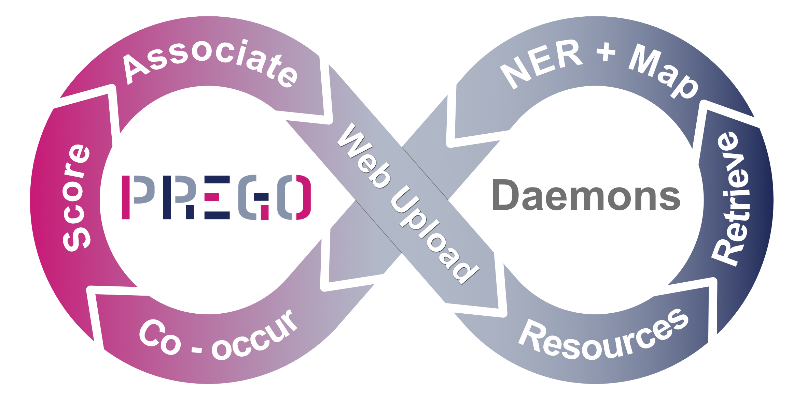

# PREGO project daemons

*Process, environment, organism (PREGO)* is a systems-biology approach 
to elucidate ecosystem function at the microbial dimension. 
To understand **how** ecosystems function it is fundamental to understand *what* 
processes occur in which environments (*where*), and which organisms carry them out (*who*). 
Its main motivation is to provide a one-stop-shop for researchers interested in 
searching and visually exploring such *what - where - who* associations.

In this repository we provide the daemons that keep our knowldege base up-to-date
by integrating latest data and by re-calculating the associations regularly.

## PREGO web-site
https://prego.hcmr.gr/

## Citation
under submission

